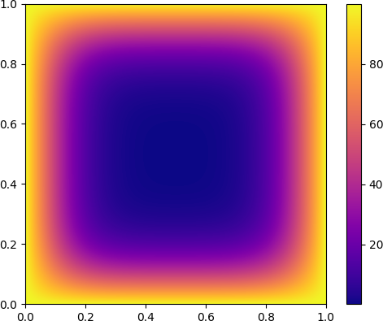

# Heat diffusion solver with MPI

This is an implementation of the final project of the course DD2356 High
Performance Computing in the spring 2021. The program `heat.c` is a solver for
the heat equation in 2D on the unit square with constant boundary
conditions. It is parallelized using MPI. The solution is written to a number of
binary files, and can be visualized using the `vis.py` script.

The following model parameters are hard-coded:
- Initial temperature: 0
- Boundary temperature: 100
- Diffusion coefficient: 4

## Build instructions

Change the `builddir` variable in the makefile. Then run `make`. This will
generate the three binaries `heat`, `heat-idle` and `heat-writeall`. The
difference is that `heat-idle` monitors idle periods and that `heat-writeall`
writes the solution at each timestep instead of just at the end.

## MPI structure

Each process owns a square tile of the domain.
They use a Cartesian communicator with a neighborhood collective. The
halo exchange is implemented as a single call to `MPI_Neighbor_alltoall`,
preceded by copies to a send buffer, and followed by copies from a receive
buffer.

## Output files

One process writes the parameters for domain size, number of timesteps and
number of processes to the file `heat-meta.bin`. At the end, or at each timestep
with `heat-writeall`, the processes write their tile to the file `heat-x-y.bin`
where `x` and `y` give the coordinate of the tile.

After the execution, the files can be transferred to a local computer and
visualized with the `vis.py` script.

## Idle period monitoring

To monitor idle periods, the call to `MPI_Neighbor_alltoall` is replaced by
calls to `MPI_Ineighbor_alltoall` and `MPI_Wait`. Right before and after the
call to `MPI_Wait` the RDTSC register is read so that the number of clock cycles
spent in the function can be measured. These measurements are then saved to a
file called `idle-x-y.bin` analogously to how the solution is saved. These files
can later be loaded by the `idle.py` script to visualize the idle period
propagation. I did not need to use `sleep` or any other trick to cause a idle
period.

## Running instructions

The program takes three parameters: number of mesh points in the x direction,
number of mesh points in the y direction, and number of timesteps.

I defined the following test cases so as to be able to compare their results to
each other. The only difference between the cases is the domain decomposition.

	$ srun -n 1 ./heat 512 512 10000
	$ srun -n 256 ./heat 512 512 10000

After running a test, the results are downloaded using and visualized using the
following commands.

	$ scp t04n27.pdc.kth.se:/cfs/klemming/scratch/j/jacobwah/*.bin .
	$ python3 vis.py

The resulting visualization is shown below. After 10k timesteps heat as diffused
from the boundaries into the domain as expected.

To confirm that the results are the same, the following command was used on the
result.

	$ cmp test1-data/vis.png test2-data/vis.png

## Performance test

The file `heat.sbatch` is a batch job script to run the performance tests. These
use the parameters `55440 55440 100` with all squares up to 256, excluding 13^2.
